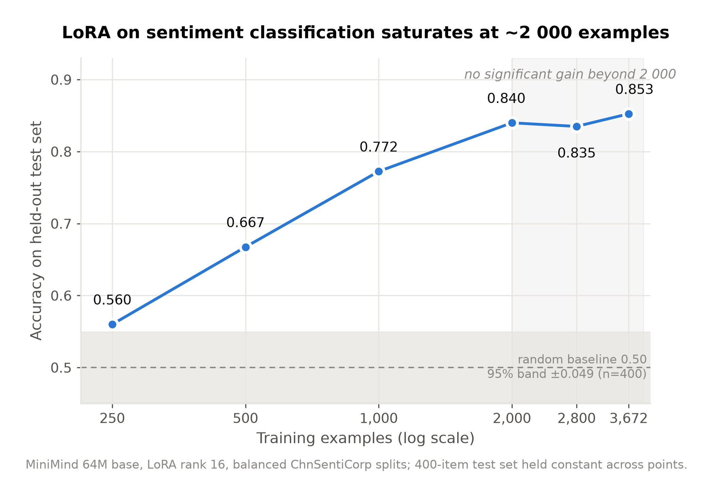
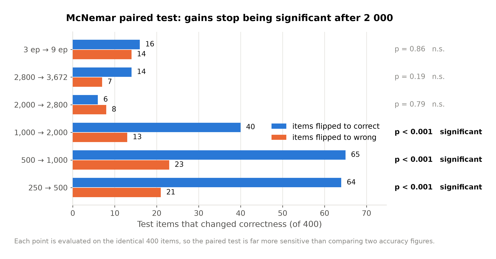
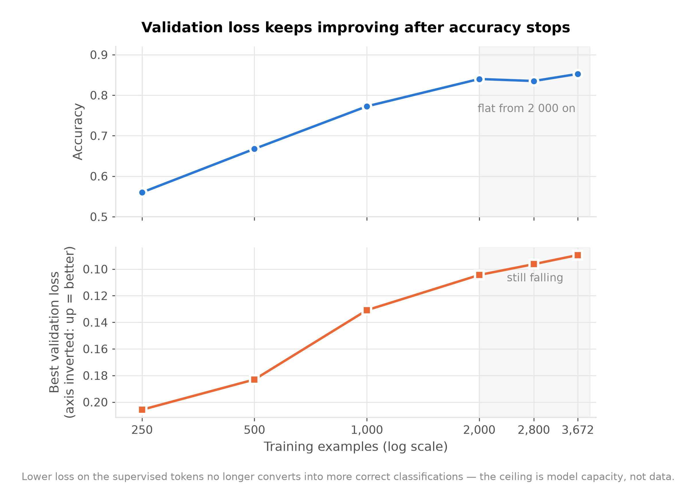
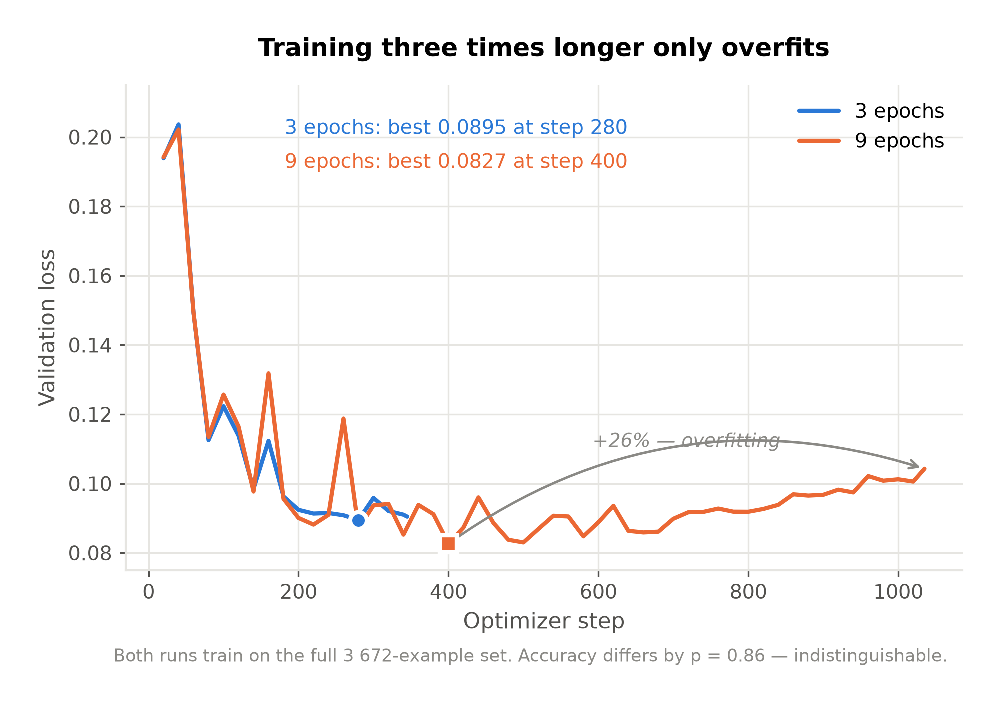
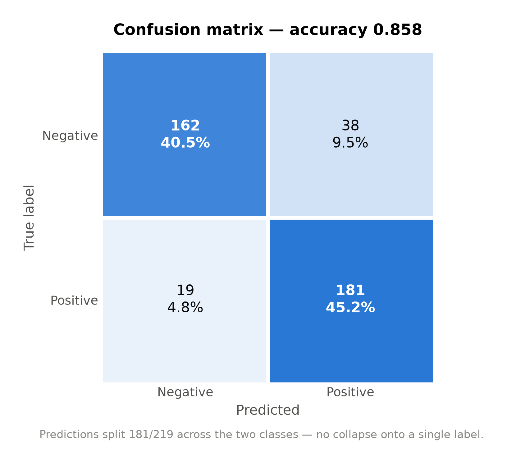
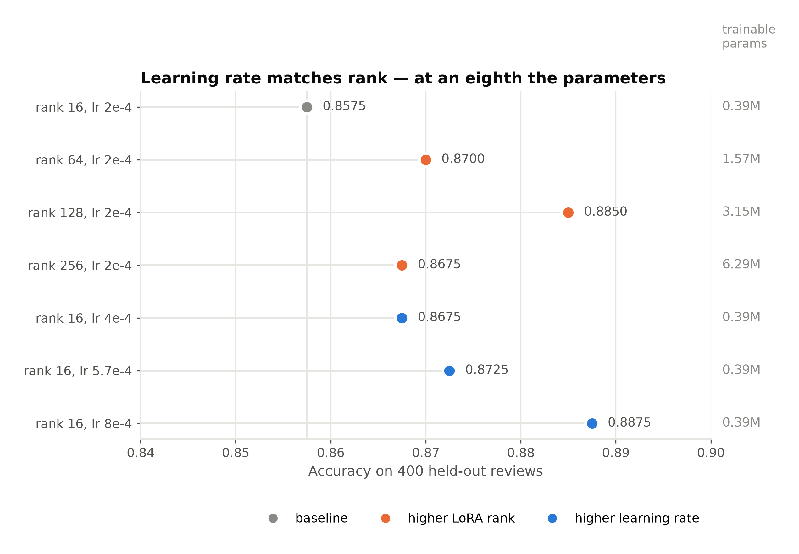

# 小模型 LoRA 微调的有效边界：一个情感分类对照实验

> 实验编号 `lora_sentiment_20260914` ｜ 报告日期 2026-09-17
>
> ⚠️ **勘误（2026-09-17 补充实验）**：本报告 §3.3 与 §4 中「0.86 的天花板来自 64M 基座
> 容量」这一断言**已被证伪**。真实原因是**学习率没调过**——原配置的 lr 2e-4 属于欠训练。
>
> 证据链分两步。先是 rank 扫描：同一基座、同一数据、同一评测集，把 LoRA rank 从 16 提到
> 128，准确率升到 0.8850（p=0.0074）。这已经说明 0.86 不是基座上限。但 rank 同时放大了
> 等效更新幅度，于是又做了学习率对照：**rank 保持 16 不变，只把 lr 提到 8e-4，准确率
> 到 0.8875**——用 1/8 的可训练参数达到了 rank 128 的水平（两者 p=1.0000，无差异）。
> 四个学习率点严格单调（0.8575 / 0.8675 / 0.8725 / 0.8875）。
>
> 所以瓶颈既不在基座容量，也不在适配器容量，而在一个从未被调过的超参数。
> 详见 [`rank_sweep.md`](rank_sweep.md)。下文相关段落已就地标注，未改写原始论证过程。
> 基座 MiniMind 64M ｜ 语料 ChnSentiCorp ｜ 硬件 RTX 3080 Ti

---

## 摘要

在 64M 参数的 MiniMind 基座上做 LoRA 微调，中文酒店评论情感二分类的测试准确率达到
**0.8575**，显著高于 0.549 的判定阈值（n=400 时的随机基线上界）。

更重要的是第二个结论：**这个任务在约 2000 条训练数据处就已经饱和**。把数据扩到语料
允许的上限 3672 条（近一倍）、把训练轮数从 3 提到 9（三倍），准确率的变化都无法通过
配对显著性检验。~~天花板来自 64M 的模型容量，而不是数据量或训练不足。~~
（**勘误**：「不是数据量」成立；「不是训练不足」与「来自 64M 基座容量」都不成立——
恰恰就是训练不足：lr 2e-4 偏低，把它提到 8e-4 即可达到 0.8875。
见 [`rank_sweep.md`](rank_sweep.md)。）

这个实验是为回答前一个失败实验遗留的问题而设计的。医学多选题实验（`lora_medical_mcq_pilot`）
中，同一套方法在同一个基座上失败——100 道题里有 89~91 题的回答无法解析。本实验证明：**失败的原因是
任务类型，不是方法或模型规模。**

---

## 1. 背景与假设

医学 MCQ 实验失败后，有两种互斥的解释：

1. **方法或规模问题** —— LoRA 在 64M 这个量级上根本学不动；
2. **任务类型问题** —— MCQ 是知识型任务，答案不在输入里，要求模型从参数中召回它本来
   就不具备的医学知识。

这两种解释指向完全不同的下一步：前者意味着该换方法，后者意味着该换任务。要区分它们，
需要一个**控制变量的对照实验**：同样的基座、同样的 LoRA 配置、同样的训练与评测流程，
只改变任务类型。

情感分类正是所需的对照组。它是**映射型任务**——判断所需的全部信息都在评论正文之内，
模型不需要具备任何外部知识。假设是：如果 LoRA 在这个量级有效，它应当先在映射型任务
上表现出来。

---

## 2. 方法

### 2.1 模型与微调配置

| 项 | 值 |
| --- | --- |
| 基座 | MiniMind，hidden 768 / 8 层 / 非 MoE，63.9M 参数 |
| 微调 | LoRA rank 16，挂在方阵 `nn.Linear` 上 |
| 可训练参数 | 0.39M，占总参数 **0.6%** |
| 精度 | bfloat16（CUDA autocast） |
| 超参 | lr 2e-4，batch 16，accumulation 2，grad clip 1.0，余弦学习率 |

### 2.2 数据处理

原始 ChnSentiCorp 7766 条评论，经五道过滤得到可用池：

| 过滤 | 剔除数 | 理由 |
| --- | --- | --- |
| 超长（真实 token 数 > 预算） | 317 | **筛除而非截断**：截断会砍掉评论尾部的转折（"但是房间有异味"），标签与输入将不再对应 |
| 过短 / 空 | 3 | 无信息量 |
| 精确重复 | 0 | 归一化文本去重 |
| 近重复（字符 bigram Jaccard ≥ 0.85） | 2 | 模板化评论会让训练集与测试集内容重叠，准确率虚高 |

可用池 7444 条：负面 2266 / 正面 5178。

**切分一律正负各半。** 这是让结果可解读的关键：原始数据正面占 68.5%，若测试集沿用这个
比例，模型只要无脑全答"正面"就有 68.5% 的准确率，无法区分它是学会了还是在偷懒。平衡
之后，固定预测多数类的准确率严格等于 0.5。

切分顺序为先 test、再 val、最后 train，因此后续扩充训练集不会扰动评测集——本实验中期
把训练集从 2000 扩到 3672 时，test/val 与各规模子集保持逐字节不变，六个规模点因而可以
横向比较。

**语料上限**：负面样本是瓶颈。test/val/smoke 每类占用 430 条，负面池仅剩 1836 条，
故平衡训练集最多 3672 条。

### 2.3 评测口径

- **候选打分（forced choice）**：分别计算"正面"与"负面"两个标签的对数似然，取高者。
  这是主指标——它不会出现"格式不合规导致无法判分"的情况，正是医学 MCQ 实验翻车的地方。
- **生成式准确率**：让模型自由生成，再解析标签。两个标签同时出现时判为无效（沿用
  `run_eval.py` 的保守口径，模型的犹豫不能记成答对）。
- **判定阈值**：随机预测的期望准确率是 0.5，但单次实测服从 Binomial(n, 0.5)/n。n=400 时
  95% 区间为 [0.451, 0.549]，**准确率必须超过 0.549** 才算显著优于随机。不与 0.5 直接比较。
- **配对检验**：各规模点评测的是同一批 400 道题，因此用 McNemar 精确检验，只统计有多少
  题改变了对错。这比比较两个准确率数字灵敏得多。

---

## 3. 结果

### 3.1 主结果：准确率与饱和点



**图 1.** 测试准确率随训练集规模的变化。灰色带为随机基线的 95% 抽样区间，右侧阴影为
饱和区。横轴为对数刻度。

| 训练条数 | 准确率 | 最优 val_loss | 训练耗时 |
| --- | --- | --- | --- |
| 250 | 0.5600 | 0.2057 | — |
| 500 | 0.6675 | 0.1830 | — |
| 1 000 | 0.7725 | 0.1309 | — |
| 2 000 | 0.8400 | 0.1044 | 43 s |
| 2 800 | 0.8350 | 0.0963 | — |
| 3 672（语料上限） | 0.8525 | 0.0895 | 79 s |
| 3 672 × 9 epoch | **0.8575** | 0.0827 | 235 s |

250 条时准确率 0.56 仅勉强越过阈值，说明这个量级的模型需要约 500 条以上才谈得上稳定
学到东西。

### 3.2 提升何时停止



**图 2.** 相邻两点之间改变了对错的题数与 McNemar 精确检验的 p 值。

相邻点相差几个百分点并不能说明趋势——n=400 时抽样噪声本身就有几个百分点。2800 点比
2000 点低 0.5pp，看起来像倒退，配对检验显示只是 8 题转错、6 题转对，纯噪声（p=0.79）。

**提升在 2000 条处止步：**

| 对比 | 转错 | 转对 | p | 判定 |
| --- | --- | --- | --- | --- |
| 250 → 500 | 21 | 64 | < 0.001 | 显著 |
| 500 → 1 000 | 23 | 65 | < 0.001 | 显著 |
| 1 000 → 2 000 | 13 | 40 | 0.0003 | 显著 |
| 2 000 → 2 800 | 8 | 6 | 0.79 | 不显著 |
| 2 800 → 3 672 | 7 | 14 | 0.19 | 不显著 |
| 3 epoch → 9 epoch | 14 | 16 | 0.86 | 不显著 |

### 3.3 天花板来自模型容量

> ⚠️ **本节结论已被证伪。** 下面两条证据本身没错——val_loss 与准确率确实脱钩，更长的
> 训练确实只会过拟合——错的是从它们推出的那一步：「既然加数据加轮数都没用，限制就来自
> 基座容量」。
>
> 这个推理漏掉了一整类可能：**没被当作变量的超参数**。当时固定了 lr 2e-4 与 rank 16，
> 于是「加数据」「加轮数」两条路都堵死时，就把剩下的唯一解释归给了基座。实际上把 lr
> 提到 8e-4，同一配置就能到 0.8875。见 [`rank_sweep.md`](rank_sweep.md)。
>
> 「更长的训练只会过拟合」这条证据尤其有迷惑性——它在 lr 2e-4 下是对的，但过拟合的是
> 一个还没走到位的解；换个学习率，同样的 9 epoch 会落在更好的点上。
>
> 教训：「A 和 B 都没用」不足以推出「瓶颈是 C」，除非 C 之外的选项已被穷尽——
> 而**所有没被扫过的超参数都属于「没被穷尽的选项」**。

两条独立证据指向同一结论。



**图 3.** 上栏准确率，下栏验证损失（纵轴反转，向上为更优）。两个量纲分栏呈现，不使用
双纵轴。

**第一条：val_loss 与准确率脱钩。** 验证损失从 0.2057 一路降到 0.0827，全程单调改善，
但准确率在 2000 条之后不再变化。模型对监督 token 的把握确实还在提高，只是这份提高不再
转化为更多答对的题。



**图 4.** 3 epoch 与 9 epoch 两次训练在 3672 条数据上的验证损失轨迹。

**第二条：更长的训练只会过拟合。** 9 epoch 的验证损失在 step 400 触底 0.0827 后持续
回升，末步 0.1043，相对最低点上涨 26%。准确率却与 3 epoch 无显著差异（p=0.86）。

### 3.4 模型确实学会了，而非碰巧蒙对



**图 5.** 最佳模型（3672 条 × 9 epoch）在 400 题测试集上的混淆矩阵。

三个旁证：

- **格式合规率 100%**：400 题全部输出了可解析的标签。作为对照，医学 MCQ 实验的 100 题中，
  基座有 89 题、LoRA 有 91 题无法解析，合规率仅 11% 与 9%。
- **预测分布 181/219**：没有塌缩到单一类别。两类 F1 分别为 0.8504 与 0.8640，均衡。
- **候选打分与生成式准确率完全一致**（均为 0.8575）：模型的内部判断与它实际吐出的字
  一致，说明能力是真实的而非评测方式的产物。

---

## 4. 结论

1. **LoRA 在 64M 量级的映射型任务上有效**，准确率 0.8575，远超随机基线。
2. **本任务在约 2000 条数据处饱和**，此后扩数据与加训练轮数均无显著收益。
3. **医学 MCQ 实验的失败源于任务类型，而非方法或模型规模。** 同一基座、同一套 LoRA 配置、
   同一套训练与评测流程，换成映射型任务即有效。知识型任务要求模型召回参数中不存在的
   知识，这不是微调能解决的问题。

### 下一步建议

> ⚠️ **已由后续实验修正。** 原文写的是「该换的是模型而不是数据」，把「更大的基座」与
> 「更高的 LoRA rank」并列为两条出路。实际跑下来，**两条都不必**：同一个基座、同一个
> rank 16，只把学习率从 2e-4 提到 8e-4 就到了 0.8875。
>
> 正确的建议顺序是：**先扫学习率 → 再考虑 rank → 最后才谈换基座**。
> 见 [`rank_sweep.md`](rank_sweep.md)。

~~要突破 0.86 这个天花板，**该换的是模型而不是数据**——更大的基座或更高的 LoRA rank。~~
继续扩语料已被证明无效。本实验留下了一条干净的 64M 基线曲线，换模型后的对比会很清楚。

对医学方向而言，可行的路径是把评测方式从生成式 MCQ 改为候选打分（本实验证明该方式在
小模型上可靠），或者把任务从知识召回改为信息抽取——后者是映射型的。

### 修正的证据



**图 6.** rank 扫描（橙）与学习率对照（蓝）从同一基线出发。两条路径的终点几乎重合，
但代价相差 8 倍：rank 128 需要 3.15M 可训练参数，rank 16 + lr 8e-4 只需 0.39M。
rank 256 反而回落，说明 rank 在这里起的是「有效学习率」的作用而非「容量」。
本图由 [`make_figures.py`](make_figures.py) 从 `runs/` 直接读数生成。

### 尚未解决的连带问题

本报告的第二个结论——**「本任务在约 2000 条数据处饱和」**——是在 lr 2e-4 下测出来的，
而这个学习率现在已知偏低。规模曲线的每一个点都可能因此被压低，饱和点也可能不在 2000 条。

要确认这一点，需要在 lr 8e-4 下重跑整条规模曲线（6 个点）。**在那之前，「2000 条饱和」
这个结论应当视为「在 lr 2e-4 下成立」，而不是这个任务的固有性质。**

同样的疑问适用于 [`lora_triage_20260917`](../lora_triage_20260917/) 的 9600 条饱和点——
那条曲线也全程使用 lr 2e-4。

---

## 5. 可复现性

```bash
python experiments/lora_sentiment_20260914/prepare_data.py   # 生成切分
bash   experiments/lora_sentiment_20260914/run_cloud.sh      # 六步全流程
python experiments/lora_sentiment_20260914/analyze_saturation.py  # 饱和分析
python experiments/lora_sentiment_20260914/make_figures.py   # 本报告的全部图表
python -m pytest tests/ -q                                   # 59 例，约 6 秒
```

- 全流程（4 次训练 + 4 次评测）在单张 RTX 3080 Ti 上约 4.5 分钟。
- 所有图表与数字均由脚本从 `runs/` 下的产物直接读取，无手工录入。
- 数据切分完整性由 `data/manifest.json` 中的 md5 保证，预检步骤会逐一核对。
- 基座权重 md5 `942a011c4b3868f6e17d7ba7d5bdc08a`，记录在每次运行的 `train_summary.json` 中。
- 逐题预测保存在各 `runs/*/eval_formal.json`，可独立重算本报告的任一指标。

### 相关文件

| 文件 | 内容 |
| --- | --- |
| [`README.md`](README.md) | 实验设计与流水线说明 |
| [`results.md`](results.md) | 自动生成的结果汇总 |
| [`saturation.md`](saturation.md) | 自动生成的饱和分析 |
| [`config.json`](config.json) | 全部超参与路径 |
| [`figures/`](figures/) | 本报告图表的 PDF（矢量）与 PNG（300 dpi） |
