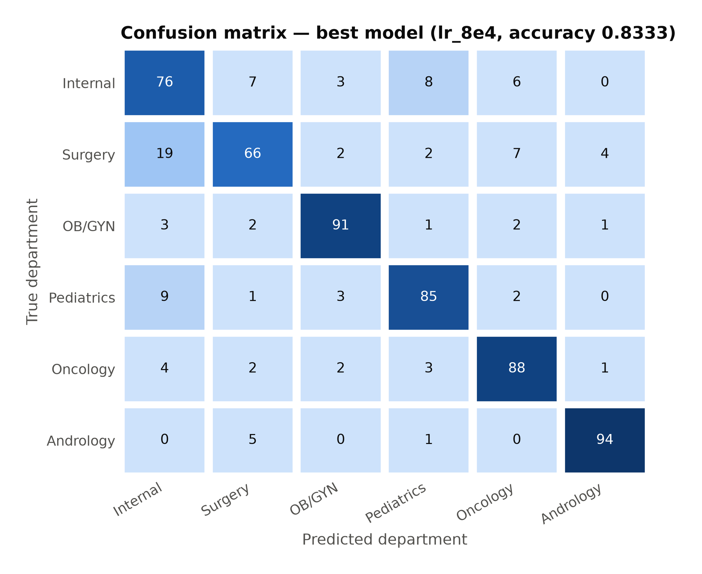
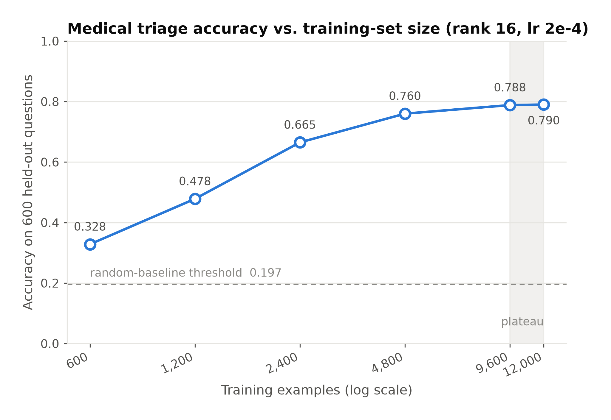
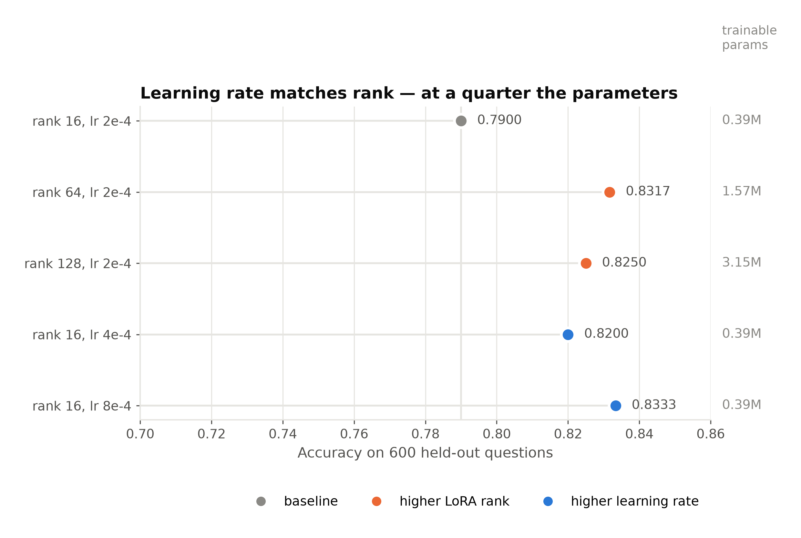
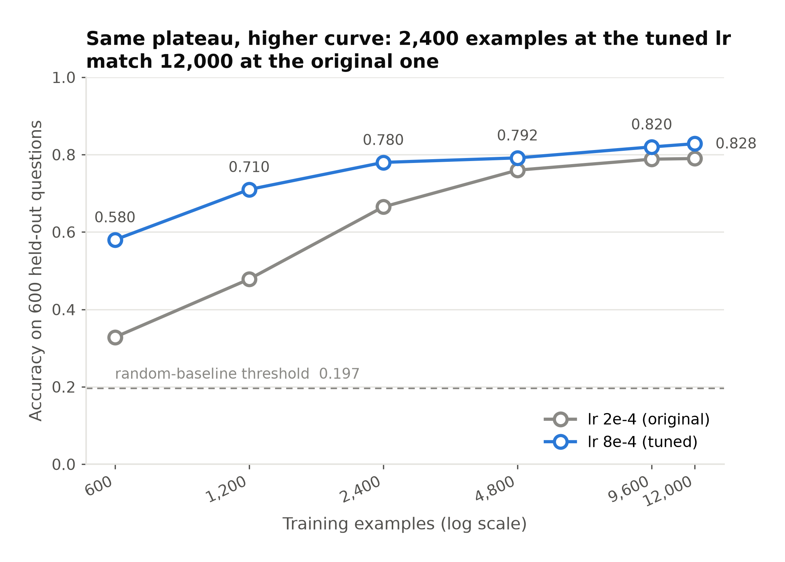

# 映射型任务在医学领域同样有效——兼论一个被误诊了两次的天花板

> 实验编号 `lora_triage_20260917` ｜ 报告日期 2026-09-17
> 基座 MiniMind 64M ｜ 语料 Chinese-medical-dialogue-data ｜ 硬件 RTX 3080 Ti

---

## 摘要

在 64M 参数的 MiniMind 基座上做 LoRA 微调，中文医疗科室分诊（六分类）的测试准确率达到
**0.8333**，远高于 0.1965 的判定阈值（n=600 时六类随机基线的上界）。格式合规率 100%，
预测分布未塌缩。

这个实验要回答的是前一个实验留下的一个跨领域推论。`lora_sentiment_20260914` 用酒店评论
证明了「LoRA 在 64M 上对映射型任务有效」，并据此把医学 MCQ 的失败归因于**任务类型**而非
**领域**。但那个证明是在非医学语料上做的，归因跨了领域却没被直接验证。本实验把任务类型
换成映射型、领域留在医学——**结论成立**。

第二个结论则是一次自我纠错。规模曲线在 9600 条处饱和，而语料还剩 98% 未用，据此很容易
写下「天花板来自模型容量」。这句话**错了两次**：先是错在「基座容量」，再是错在「适配器
容量」。真正的原因是**学习率从未被调过**——rank 保持 16 不变，只把 lr 从 2e-4 提到 8e-4，
准确率就从 0.7900 升到 0.8333。

补测（§3.4）把整条规模曲线在调好的学习率下重跑了一遍，结论一分为二：**饱和的位置是真的
（仍在 9600 条），饱和的水平不是**——六个规模点全部被显著抬高，且数据量越少抬得越多。
2400 条配一个调对的学习率，就追平了 12000 条配错学习率的成绩。

---

## 1. 背景

三个实验构成一条链：

| 实验 | 任务类型 | 领域 | 结果 |
| --- | --- | --- | --- |
| `lora_medical_mcq_pilot` | 知识型 | 医学 | ❌ 六轮均未显著超过随机（0.2015） |
| `lora_sentiment_20260914` | 映射型 | 通用 | ✅ 0.8575（后修正为 0.8875） |
| **本实验** | **映射型** | **医学** | ✅ **0.8333** |

前两个实验之间缺一环：情感实验证明「映射型任务可行」，但它换掉的不只是任务类型，还有
领域。如果医学文本本身有什么特殊之处（术语密度、基座预训练覆盖不足），那么「换个医学
映射型任务就行」这个推论就不成立。本实验补上这一环。

分诊属于映射型：判断所需的线索（症状、部位、性别与年龄暗示）全部在患者自述之内，
模型不需要具备「某病属于某科」之外的医学知识。

### 这个实验还能回答的第二个问题

情感实验在 2000 条处饱和，但它的语料上限恰好是 3672 条——「模型容量饱和」与「语料耗尽」
纠缠在一起。本实验语料有 **79 万条**，训练集推到 12000 条也只用掉零头，可以干净地分开
这两者。

---

## 2. 方法

| 项 | 值 |
| --- | --- |
| 基座 | MiniMind，hidden 768 / 8 层 / 非 MoE，63.9M 参数 |
| 微调 | LoRA rank 16，挂在方阵 `nn.Linear` 上，可训练 0.39M（占 0.62%） |
| 任务 | 六分类：内科 / 外科 / 妇产科 / 儿科 / 肿瘤科 / 男科 |
| 输入 | 患者自述（`ask` 列），不含标题与医生回复 |
| 切分 | 12000 / 600 / 600，六类等量；另有 60/30 冒烟集 |
| 序列 | max_seq_len 320（覆盖 99.7%），超长样本筛除而非截断 |
| 超参 | lr 2e-4，batch 16，accumulation 2，3 epoch，bfloat16 |

原始语料 792099 条 → 609161 段不同自述 → 剔除 1425 段跨科室矛盾条目 → 每类抽样 5000 →
长度过滤丢 103 条 → 类内近重复去重丢 145 条。切分互斥性按 id 与文本双重校验。
数据流水线的每一步与设计理由见 [README.md](README.md)。

### 评测口径

六类平衡让固定预测多数类的准确率严格等于 1/6，随机预测期望也是 1/6；n=600 时
「显著优于随机」需准确率 **> 0.1965**。

一个本实验特有的坑：**六个科室名的 token 数不等**（内科/外科/儿科/男科 4，妇产科 6，
肿瘤科 7）。候选打分若沿用情感实验的 log-prob 求和口径，长标签每多一个 token 就多乘一个
小于 1 的概率，会被系统性压低。因此主指标改为**每 token 平均 log-prob**，两个口径同时
记录。实测两者一致率 99.0%，影响很小，但这是事前就该排除的系统偏差，而不是事后发现
数字不对再回头查。

---

## 3. 结果

### 3.1 映射型任务在医学领域有效



**图 1.** 最佳模型（rank 16，lr 8e-4）在 600 题测试集上的混淆矩阵。行为真值、列为预测，
颜色用单一蓝色 sequential ramp 编码计数。

对应的数值：

```
           内科    外科   妇产科    儿科   肿瘤科    男科      F1
   内科      76      7      3      8      6      0    0.720
   外科      19     66      2      2      7      4    0.721
  妇产科       3      2     91      1      2      1    0.905
   儿科       9      1      3     85      2      0    0.850
  肿瘤科       4      2      2      3     88      1    0.859
   男科       0      5      0      1      0     94    0.940
```

三个旁证说明模型确实学会了，而非碰巧蒙对：

- **格式合规率 100%**：600 题全部输出可解析的科室名。作为对照，医学 MCQ 实验的 100 题中
  基座有 89 题、LoRA 有 91 题无法解析，合规率仅 11% 与 9%。
- **预测分布未塌缩**：六类预测数分别为 111/83/101/100/105/100，没有退化成「全答内科」。
- **候选打分与生成式准确率完全一致**（均为 0.8333）：模型的内部判断与它实际吐出的字一致。

**混淆集中在临床上本就模糊的边界**：内科↔外科互相误判 26 例，是最大的一对；而男科
（F1 0.940）、妇产科（0.905）这类有强性别线索的科室几乎不出错。这个误差结构本身说明
模型学的是症状到科室的映射，不是表面统计。

### 3.2 规模曲线：饱和点与语料上限无关

| 训练条数 | 准确率 | 最优 val_loss | 相邻点是否显著提升 |
| --- | --- | --- | --- |
| 600 | 0.3283 | 0.3370 | — |
| 1200 | 0.4783 | 0.2850 | ✅ p<0.0001 |
| 2400 | 0.6650 | 0.2024 | ✅ p<0.0001 |
| 4800 | 0.7600 | 0.1659 | ✅ p<0.0001 |
| 9600 | 0.7883 | 0.1344 | ✅ p=0.0241 |
| 12000 | 0.7900 | 0.1308 | ❌ p=1.0000 |



**图 2.** 数据量与准确率的关系（对数横轴）。虚线是 n=600 时「显著优于随机」的判定阈值
0.197，灰带标出不再显著提升的区段。

提升在 **9600 条**处止步。相邻点用 McNemar 配对检验（各点评测同一批 600 题），
详见 [saturation.md](saturation.md)。

关键在于：**语料还剩 98% 没用**（79 万条里只用了 1.2 万）。所以这个平台期确定不是语料
耗尽造成的——这一点比情感实验干净，那里 3672 条恰好就是语料上限，两种解释无法分开。

### 3.3 天花板被误诊了两次

到 §3.2 为止，很容易写下「限制来自模型容量」。**情感实验当初就是这么写的，而它错了。**
本实验因此补了两组对照，其余条件与 12000 条的正式训练完全一致：

| 配置 | rank | lr | 可训练参数 | 准确率 | vs 锚点 p |
| --- | --- | --- | --- | --- | --- |
| 锚点 | 16 | 2e-4 | 0.39M | 0.7900 | — |
| rank 对照 | 64 | 2e-4 | 1.57M | 0.8317 | 0.0006 ✅ |
| rank 对照 | 128 | 2e-4 | 3.15M | 0.8250 | 0.0038 ✅ |
| 学习率对照 | 16 | 4e-4 | 0.39M | 0.8200 | 0.0096 ✅ |
| **学习率对照** | **16** | **8e-4** | **0.39M** | **0.8333** | **0.0003 ✅** |



**图 3.** 两条干预路径的终点几乎重合，参数代价却相差 4 倍。橙色是加 rank，蓝色是加学习率，
灰色是基线；右侧标注各自的可训练参数量。用点图而非柱状图，因为准确率的有意义基线是 1/6
而不是 0。

**第一次误诊：基座容量。** rank 64 就比 rank 16 高 4.2 个百分点（p=0.0006），
证明 0.79 不是 64M 基座的上限。

**第二次误诊：适配器容量。** 「加 rank 有效 ⇒ 瓶颈是适配器容量」这一步也是错的。
本仓库的 LoRA 没有 `alpha/rank` 缩放（前向就是 `B(A(x))`，B 零初始化），训练后
`‖B·A‖` 大致随 √rank 增长——**加 rank 顺带放大了等效更新幅度，等于变相提了学习率**。
把 rank 锁死在 16、只把学习率提到 8e-4，准确率到 0.8333，与 rank 64 无显著差异
（p=1.0000），参数量只有 1/4。

**旁证：rank 曲线并不单调。** 峰值在 rank 64，rank 128 反而回落到 0.8250。多给容量
不该变差；但若 rank 实际充当的是有效学习率，冲过最优点后变差正是预期行为。
情感实验的 rank 曲线呈现完全相同的形状（峰值 rank 128，rank 256 回落）。

所以真正的瓶颈是**一个从未被扫过的超参数**。

### 3.4 在调好的学习率下重跑规模曲线

§3.3 把一个待办留在了原地：**整条规模曲线全程跑在 lr 2e-4 上，而这个学习率已被证明偏低。**
「9600 条饱和」因此只能算「在一个欠训练的学习率下的饱和」。本节把它补完。

补测在另一块显卡（RTX 3090）上进行，所以先复现锚点再谈别的：12000 条 @ 2e-4 得到
**0.7917**，与原来的 0.7900 相差 600 题里的 1 题，`best_val_loss` 0.13088 vs 0.1308。
跨硬件可比这一点成立。

还有一个缺口：原报告的 lr 只扫到 8e-4 就停了，而 2e-4 → 4e-4 → 8e-4 单调递增，
**峰值根本没有被兜住**——8e-4 只是「试过的里面最好的」，不是最优的。补两个点：

| lr | 准确率 | 最优 val_loss |
| --- | --- | --- |
| 2e-4 | 0.7917 | 0.1309 |
| **8e-4** | **0.8283** | 0.1164 |
| 1.6e-3 | 0.8250 | 0.1068 |
| 3.2e-3 | 0.8283 | 0.1139 |

曲线在 8e-4 之后走平，再往上加没有收益，8e-4 就在拐点上。重跑用它。

（本表全部来自 3090，所以 8e-4 记的是 **0.8283**，而全文引用的 8e-4 headline 是 3080 Ti 上的 **0.8333**——同一份配置、同一批测试题，两块卡差 3/600 题，与上面 2e-4 锚点差 1/600 题是同一回事。本表与 lr 上界扫描内部都只用 3090 的数字，§3.3 及以前一律用 3080 Ti 的。）



**图 4.** 同一条规模曲线在两个学习率下的对照。灰色是原曲线（lr 2e-4），蓝色是重跑
（lr 8e-4）。两条线用的是同一批训练子集与同一批 600 道测试题，只有学习率不同。

| 训练条数 | lr 2e-4 | lr 8e-4 | 差值 | p |
| --- | --- | --- | --- | --- |
| 600 | 0.3283 | 0.5800 | **+0.2517** | <0.0001 ✅ |
| 1200 | 0.4783 | 0.7100 | **+0.2317** | <0.0001 ✅ |
| 2400 | 0.6650 | 0.7800 | +0.1150 | <0.0001 ✅ |
| 4800 | 0.7600 | 0.7917 | +0.0317 | 0.0271 ✅ |
| 9600 | 0.7883 | 0.8200 | +0.0317 | 0.0094 ✅ |
| 12000 | 0.7900 | 0.8283 | +0.0383 | 0.0022 ✅ |

**六个点全部显著抬高。** 但真正值得注意的是结论分成了两半，而原报告只预料到其中一半：

**饱和点没有移动。** 重跑曲线上最后一次显著提升仍然落在 4800 → 9600（p=0.0186），
9600 → 12000 依旧不显著（p=0.5327）。所以「9600 条之后加数据不再有收益」这个判断
**在调好的学习率下依然成立**——原报告担心饱和位置是学习率的假象，这一点没有应验。

**但饱和的水平变了，而且低数据量端变得最多。** 600 条上 +25 个百分点，12000 条上只有
+3.8 个。换个说法更直观：**2400 条 @ 8e-4（0.7800）与 12000 条 @ 2e-4（0.7900）
之间检验不出差异（p=0.51）**，4800 条 @ 8e-4 同样如此（p=1.00）。在这个任务上，
把学习率调对，顶得上数据量翻五倍。

（严格说，「检验不出差异」不等于「相等」：n=600 时单点的分辨力有限，上面那句话的意思是
这两个配置的差距小到本实验测不出来，不是它们严格相等。）

**上表是跨机器对照**，这一点要讲明：lr 2e-4 一列全部取自 3080 Ti 的原始 `runs/`，
lr 8e-4 一列取自 3090——重跑只覆盖了 8e-4 那一条曲线，2e-4 的六个点没有在 3090 上重训。
开篇的锚点复现正是为许可这件事而做的。12000 这个点另有同机对照可查，两种算法给出同一个
判断：3090 内部 0.7917 → 0.8283（Δ=+0.0367，转错 14 / 转对 36，p=0.0026），
跨机器 0.7900 → 0.8283（Δ=+0.0383，转错 15 / 转对 38，p=0.0022）。

**还有一个方法学上的坑值得记下来。** 重跑曲线的显著性**不单调**：2400 → 4800 这一步
不显著（p=0.4011），但 4800 → 9600 又显著了（p=0.0186）。原来的分析脚本取「第一个不显著
的相邻步」作为饱和点，在这条曲线上会报出 2400——一个被中途抽样噪声制造出来的假平台。
判定逻辑已改为取**最后一次显著提升的终点**，原曲线的结论不受影响（那条曲线的显著性恰好
单调，两种算法给出同一个答案），但这正是那种不撞上就不会发现的错误。

---

## 4. 结论

1. **映射型任务在医学领域同样有效**，准确率 0.8333，远超随机基线。情感实验那条跨领域
   归因成立：**医学 MCQ 的失败源于任务类型，不是领域。**
2. **9600 条处的平台期与语料无关**（还剩 98% 未用），但也**不是模型容量**——是学习率。
3. **「加数据没用 + 加轮数没用 ⇒ 瓶颈是模型容量」这个推理模式是错的。** 它默认了所有
   超参数都已调好。在两个独立任务上，没调过的学习率都伪装成了「容量天花板」。
4. **在调好的学习率下重跑整条曲线后（§3.4），结论分成两半：饱和的「位置」是真的，
   饱和的「水平」不是。** 9600 条之后加数据依然没有收益；但整条曲线被抬高，
   且低数据量端抬得最多——2400 条配对好的学习率，就追平了 12000 条配错学习率的成绩。
5. **实践上这意味着：数据少的时候，先去调学习率，不要先去堆数据。** 本实验里，
   600 条上调对学习率值 +25 个百分点，而把数据从 600 加到 1200 只值 +15 个。

### 下一步

- **情感实验的 2000 条饱和点还没有重跑**，它和本实验原来的问题一模一样（整条曲线跑在
  lr 2e-4 上）。本实验的经验说明重跑值得做，但也说明该预期什么：饱和位置多半不动，
  动的是水平。
- 本实验的 lr 扫描是在 12000 条上做的，**最优学习率与数据量之间是否有交互作用没有测**。
  §3.4 的收益在低数据量端大得多，暗示小样本点可能还有更高的最优 lr。
- 三个实验至此都只动了「任务类型」与「超参数」这两条轴。**基座规模这条轴一次都没动过**——
  所有「64M 基座够不够」的说法目前都只是推断。

---

## 5. 可复现性

```bash
python experiments/lora_triage_20260917/fetch_raw.py        # 下载并校验原始语料
python experiments/lora_triage_20260917/prepare_data.py     # 生成切分
bash   experiments/lora_triage_20260917/run_cloud.sh        # 六步全流程
bash   experiments/lora_triage_20260917/run_rank_check.sh   # rank 64 / 128 对照
bash   experiments/lora_triage_20260917/run_lr_check.sh     # lr 4e-4 / 8e-4 对照
bash   experiments/lora_triage_20260917/run_lr_check.sh --lrs "0.0016 0.0032"  # §3.4 lr 上界
bash   experiments/lora_triage_20260917/run_scale_lr.sh --lr 0.0008            # §3.4 曲线重跑
python experiments/lora_triage_20260917/analyze_scale.py    # 生成 saturation.md
python experiments/lora_triage_20260917/analyze_scale.py --curve-lr 8e4 --runs-dir runs_3090
python -m pytest tests/test_triage_logic.py -q              # 46 例纯逻辑测试
```

- 全流程（6 次训练 + 6 次评测）在单张 RTX 3080 Ti 上约 15 分钟；两组对照各约 9 分钟。
- 所有数字均由脚本从 `runs/` 下的产物直接读取，无手工录入。
- 数据切分完整性由 `data/manifest.json` 中的 md5 保证，预检步骤逐一核对。
- 基座权重 md5 `942a011c4b3868f6e17d7ba7d5bdc08a`，记录在每次运行的 `train_summary.json` 中。
- 逐题预测保存在各 `runs/*/eval_formal.json`，可独立重算本报告的任一指标。

### 图表

| 图 | 内容 |
| --- | --- |
| [`figures/fig1_scale_curve`](figures/fig1_scale_curve.png) | 数据量 → 准确率，含随机基线阈值与平台区 |
| [`figures/fig2_confusion_matrix`](figures/fig2_confusion_matrix.png) | 最佳模型的六类混淆矩阵 |
| [`figures/fig3_capacity_vs_lr`](figures/fig3_capacity_vs_lr.png) | 加 rank 与加学习率的对照 |
| [`figures/fig4_scale_lr_overlay`](figures/fig4_scale_lr_overlay.png) | 两个学习率下的规模曲线对照（§3.4）|

均由 [`make_figures.py`](make_figures.py) 从 `runs/` 直接读数生成，无硬编码数字；
同时输出 PDF（矢量，供排版）与 PNG（300 dpi，供预览）。坐标轴与图注使用英文，
以便在未装中文字体的机器上也能正确重绘。

### 相关文件

| 文件 | 内容 |
| --- | --- |
| [`README.md`](README.md) | 实验设计与流水线说明 |
| [`saturation.md`](saturation.md) | 自动生成的规模曲线与对照分析（lr 2e-4）|
| [`saturation_lr8e4.md`](saturation_lr8e4.md) | 同上，lr 8e-4 重跑曲线（§3.4）|
| `runs_3090/` | §3.4 的全部产物。单独存放是因为它们跑在另一块显卡上——与 `runs/` 混在一起，「哪些数字来自同一台机器」就不再可查 |
| [`config.json`](config.json) | 全部超参与路径 |
| [`../lora_sentiment_20260914/rank_sweep.md`](../lora_sentiment_20260914/rank_sweep.md) | 情感实验的同类对照，本实验的结论与之互为验证 |
